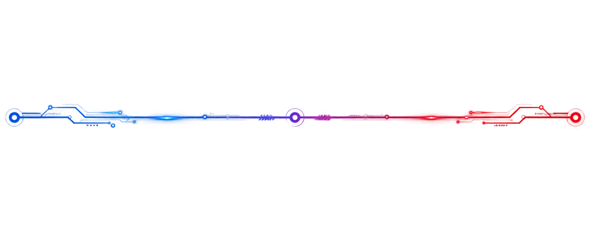
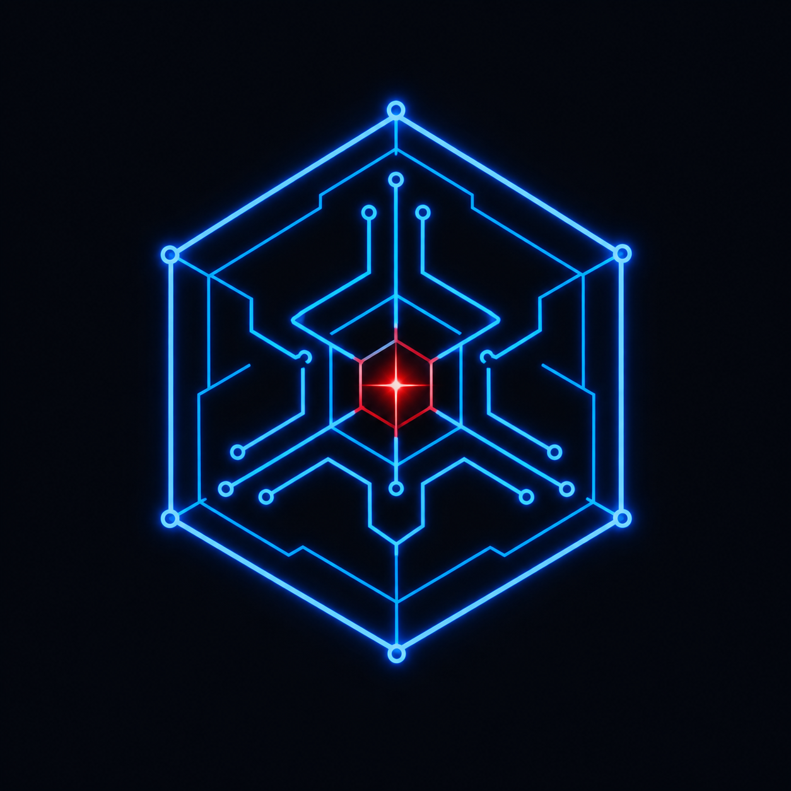
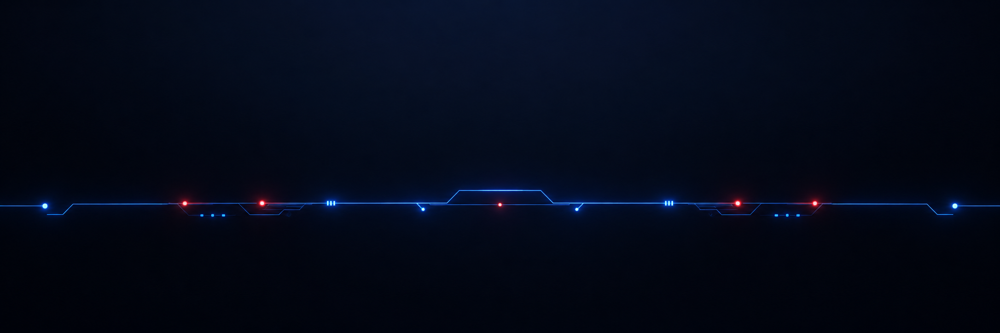

   
   </a>  
  
 

  

## 🧭 About Me

  

- 🎓 B.Tech Computer Science @ **IIIT Raichur**
  
- 🎤 **Sponsorship Team Head — TEDxIIITR "Navonmesh"** (leading a team of 8, event on Sep 26, 2026)
  
- 🎥 Core member, **PR/Video Team**, IIIT Raichur — carried the heaviest workload on video coverage for 2025–26
  
- 💻 Full-stack developer — I like taking projects from a rough idea to something deployed and demo-able
  
- 🏆 Active hackathon builder — recent build: 5 parallel AI agents shipped in 48 hours
  
- 🌱 Currently deep in Operating Systems, Compiler Design, and DBMS while applying to full-stack internships

 

## 🛠️ Tech Stack

  

## 🚀 Featured Projects

| Project | Description | Stack |
|---|---|---|
| **[LeadFlow](https://github.com/mikeydebug)** | Real-time Meta Lead Ads integration — captures Meta webhook leads and streams them live to a mobile app | Node.js · Express · TypeScript · Socket.io · React Native (Expo) |
| **[StudyWire](https://github.com/mikeydebug)** | Built in 48 hrs at the Anakin AI Hackathon — 5 parallel AI agents (Concept, Analogy, PYQ, Quiz, Study Plan) via `Promise.allSettled`, Hinglish support, glassmorphism "Mission Control" UI | React · AI Agents · Groq/LLaMA |
| **[NGO Awareness Portal](https://github.com/mikeydebug)** | Dark-themed awareness site with 3D effects and parallax scrolling, built for InAmigos Foundation's Project Vikas | React · Three.js · Vercel |
| **PankhAI** | - | — |
| **Swarm CEO** | - | — |
| **CrowdBuddy** | - | — |
| **HAQMS** | - | — |
| **StayNest** | - | — |

 

## 📊 GitHub Analytics

 

  

  

## 🐍 Contribution Snake

<picture>
  <source media="(prefers-color-scheme: dark)" srcset="https://raw.githubusercontent.com/mikeydebug/mikeydebug/output/github-contribution-grid-snake-dark.svg" />
  <source media="(prefers-color-scheme: light)" srcset="https://raw.githubusercontent.com/mikeydebug/mikeydebug/output/github-contribution-grid-snake.svg" />
  
</picture>

## 🤝 Connect

 

